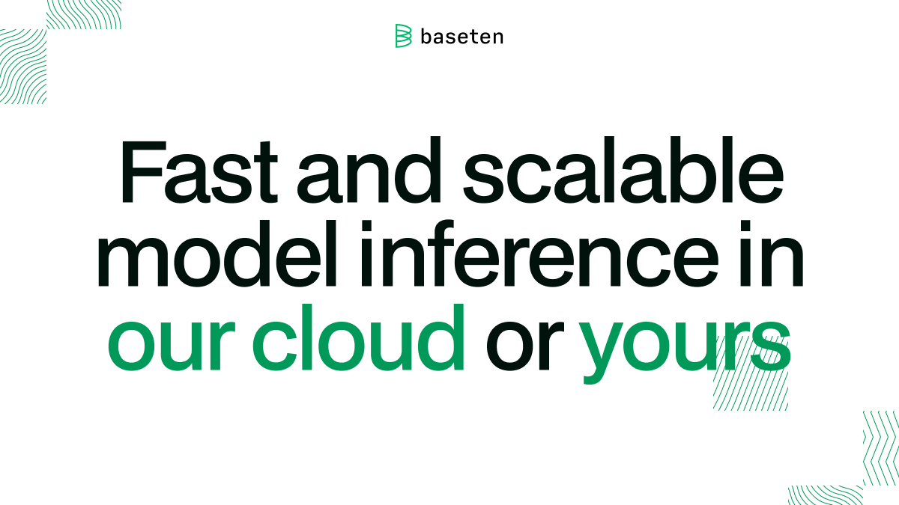

<div align="center">

[](https://baseten.co)

# [Baseten](https://baseten.co)<a id="baseten"></a>

REST API for management of Baseten resources

</div>

## Table of Contents<a id="table-of-contents"></a>

<!-- toc -->

- [Installation](#installation)
- [Getting Started](#getting-started)
- [Reference](#reference)
  * [`baseten.autoscalingSetting.updateDeploymentSettings`](#basetenautoscalingsettingupdatedeploymentsettings)
  * [`baseten.autoscalingSetting.updateDevelopmentSetting`](#basetenautoscalingsettingupdatedevelopmentsetting)
  * [`baseten.autoscalingSetting.updateStatus`](#basetenautoscalingsettingupdatestatus)
  * [`baseten.deployment.detailsGet`](#basetendeploymentdetailsget)
  * [`baseten.deployment.getDevelopmentDetails`](#basetendeploymentgetdevelopmentdetails)
  * [`baseten.deployment.getProductionDetails`](#basetendeploymentgetproductiondetails)
  * [`baseten.model.deployPromote`](#basetenmodeldeploypromote)
  * [`baseten.model.deploymentPromote`](#basetenmodeldeploymentpromote)
  * [`baseten.model.getAllDeployments`](#basetenmodelgetalldeployments)
  * [`baseten.model.getAllModels`](#basetenmodelgetallmodels)
  * [`baseten.model.getModelById`](#basetenmodelgetmodelbyid)
  * [`baseten.secret.getAllSecrets`](#basetensecretgetallsecrets)
  * [`baseten.secret.upsertNewSecret`](#basetensecretupsertnewsecret)

<!-- tocstop -->

## Installation<a id="installation"></a>
<div align="center">
  <a href="https://konfigthis.com/sdk-sign-up?company=Baseten&language=TypeScript">
    
  </a>
</div>

## Getting Started<a id="getting-started"></a>

```typescript
import { Baseten } from "baseten-typescript-sdk";

const baseten = new Baseten({
  // Defining the base path is optional and defaults to https://api.baseten.co
  // basePath: "https://api.baseten.co",
  apiKey: "API_KEY",
});

const updateDeploymentSettingsResponse =
  await baseten.autoscalingSetting.updateDeploymentSettings({});

console.log(updateDeploymentSettingsResponse);
```

## Reference<a id="reference"></a>


### `baseten.autoscalingSetting.updateDeploymentSettings`<a id="basetenautoscalingsettingupdatedeploymentsettings"></a>

Updates a deployment's autoscaling settings and returns the update status.

#### 🛠️ Usage<a id="🛠️-usage"></a>

```typescript
const updateDeploymentSettingsResponse =
  await baseten.autoscalingSetting.updateDeploymentSettings({});
```

#### ⚙️ Parameters<a id="⚙️-parameters"></a>

##### modelId: `string`<a id="modelid-string"></a>

##### deploymentId: `string`<a id="deploymentid-string"></a>

##### min_replica: `number`<a id="min_replica-number"></a>

Minimum number of replicas

##### max_replica: `number`<a id="max_replica-number"></a>

Maximum number of replicas

##### autoscaling_window: `number`<a id="autoscaling_window-number"></a>

Timeframe of traffic considered for autoscaling decisions

##### scale_down_delay: `number`<a id="scale_down_delay-number"></a>

Waiting period before scaling down any active replica

##### concurrency_target: `number`<a id="concurrency_target-number"></a>

Number of requests per replica before scaling up

#### 🔄 Return<a id="🔄-return"></a>

[UpdateAutoscalingSettingsResponseV1](./models/update-autoscaling-settings-response-v1.ts)

#### 🌐 Endpoint<a id="🌐-endpoint"></a>

`/v1/models/{model_id}/deployments/{deployment_id}/autoscaling_settings` `PATCH`

[🔙 **Back to Table of Contents**](#table-of-contents)

---


### `baseten.autoscalingSetting.updateDevelopmentSetting`<a id="basetenautoscalingsettingupdatedevelopmentsetting"></a>

Updates a development deployment's autoscaling settings and returns the update status.

#### 🛠️ Usage<a id="🛠️-usage"></a>

```typescript
const updateDevelopmentSettingResponse =
  await baseten.autoscalingSetting.updateDevelopmentSetting({});
```

#### ⚙️ Parameters<a id="⚙️-parameters"></a>

##### modelId: `string`<a id="modelid-string"></a>

##### min_replica: `number`<a id="min_replica-number"></a>

Minimum number of replicas

##### max_replica: `number`<a id="max_replica-number"></a>

Maximum number of replicas

##### autoscaling_window: `number`<a id="autoscaling_window-number"></a>

Timeframe of traffic considered for autoscaling decisions

##### scale_down_delay: `number`<a id="scale_down_delay-number"></a>

Waiting period before scaling down any active replica

##### concurrency_target: `number`<a id="concurrency_target-number"></a>

Number of requests per replica before scaling up

#### 🔄 Return<a id="🔄-return"></a>

[UpdateAutoscalingSettingsResponseV1](./models/update-autoscaling-settings-response-v1.ts)

#### 🌐 Endpoint<a id="🌐-endpoint"></a>

`/v1/models/{model_id}/deployments/development/autoscaling_settings` `PATCH`

[🔙 **Back to Table of Contents**](#table-of-contents)

---


### `baseten.autoscalingSetting.updateStatus`<a id="basetenautoscalingsettingupdatestatus"></a>

Updates a production deployment's autoscaling settings and returns the update status.

#### 🛠️ Usage<a id="🛠️-usage"></a>

```typescript
const updateStatusResponse = await baseten.autoscalingSetting.updateStatus({});
```

#### ⚙️ Parameters<a id="⚙️-parameters"></a>

##### modelId: `string`<a id="modelid-string"></a>

##### min_replica: `number`<a id="min_replica-number"></a>

Minimum number of replicas

##### max_replica: `number`<a id="max_replica-number"></a>

Maximum number of replicas

##### autoscaling_window: `number`<a id="autoscaling_window-number"></a>

Timeframe of traffic considered for autoscaling decisions

##### scale_down_delay: `number`<a id="scale_down_delay-number"></a>

Waiting period before scaling down any active replica

##### concurrency_target: `number`<a id="concurrency_target-number"></a>

Number of requests per replica before scaling up

#### 🔄 Return<a id="🔄-return"></a>

[UpdateAutoscalingSettingsResponseV1](./models/update-autoscaling-settings-response-v1.ts)

#### 🌐 Endpoint<a id="🌐-endpoint"></a>

`/v1/models/{model_id}/deployments/production/autoscaling_settings` `PATCH`

[🔙 **Back to Table of Contents**](#table-of-contents)

---


### `baseten.deployment.detailsGet`<a id="basetendeploymentdetailsget"></a>

Gets a model's deployment by id and returns the deployment.

#### 🛠️ Usage<a id="🛠️-usage"></a>

```typescript
const detailsGetResponse = await baseten.deployment.detailsGet({});
```

#### ⚙️ Parameters<a id="⚙️-parameters"></a>

##### modelId: `string`<a id="modelid-string"></a>

##### deploymentId: `string`<a id="deploymentid-string"></a>

#### 🔄 Return<a id="🔄-return"></a>

[DeploymentV1](./models/deployment-v1.ts)

#### 🌐 Endpoint<a id="🌐-endpoint"></a>

`/v1/models/{model_id}/deployments/{deployment_id}` `GET`

[🔙 **Back to Table of Contents**](#table-of-contents)

---


### `baseten.deployment.getDevelopmentDetails`<a id="basetendeploymentgetdevelopmentdetails"></a>

Gets a model's development deployment and returns the deployment.

#### 🛠️ Usage<a id="🛠️-usage"></a>

```typescript
const getDevelopmentDetailsResponse =
  await baseten.deployment.getDevelopmentDetails({});
```

#### ⚙️ Parameters<a id="⚙️-parameters"></a>

##### modelId: `string`<a id="modelid-string"></a>

#### 🔄 Return<a id="🔄-return"></a>

[DeploymentV1](./models/deployment-v1.ts)

#### 🌐 Endpoint<a id="🌐-endpoint"></a>

`/v1/models/{model_id}/deployments/development` `GET`

[🔙 **Back to Table of Contents**](#table-of-contents)

---


### `baseten.deployment.getProductionDetails`<a id="basetendeploymentgetproductiondetails"></a>

Gets a model's production deployment and returns the deployment.

#### 🛠️ Usage<a id="🛠️-usage"></a>

```typescript
const getProductionDetailsResponse =
  await baseten.deployment.getProductionDetails({});
```

#### ⚙️ Parameters<a id="⚙️-parameters"></a>

##### modelId: `string`<a id="modelid-string"></a>

#### 🔄 Return<a id="🔄-return"></a>

[DeploymentV1](./models/deployment-v1.ts)

#### 🌐 Endpoint<a id="🌐-endpoint"></a>

`/v1/models/{model_id}/deployments/production` `GET`

[🔙 **Back to Table of Contents**](#table-of-contents)

---


### `baseten.model.deployPromote`<a id="basetenmodeldeploypromote"></a>

Creates a new production deployment from the development deployment, the currently building deployment is returned.

#### 🛠️ Usage<a id="🛠️-usage"></a>

```typescript
const deployPromoteResponse = await baseten.model.deployPromote({
  scale_down_previous_production: true,
});
```

#### ⚙️ Parameters<a id="⚙️-parameters"></a>

##### modelId: `string`<a id="modelid-string"></a>

##### scale_down_previous_production: `boolean`<a id="scale_down_previous_production-boolean"></a>

Whether to scale down the previous production deployment after promoting

#### 🔄 Return<a id="🔄-return"></a>

[DeploymentV1](./models/deployment-v1.ts)

#### 🌐 Endpoint<a id="🌐-endpoint"></a>

`/v1/models/{model_id}/deployments/development/promote` `POST`

[🔙 **Back to Table of Contents**](#table-of-contents)

---


### `baseten.model.deploymentPromote`<a id="basetenmodeldeploymentpromote"></a>

Promotes an existing deployment to production and returns the same deployment.

#### 🛠️ Usage<a id="🛠️-usage"></a>

```typescript
const deploymentPromoteResponse = await baseten.model.deploymentPromote({
  scale_down_previous_production: true,
});
```

#### ⚙️ Parameters<a id="⚙️-parameters"></a>

##### modelId: `string`<a id="modelid-string"></a>

##### deploymentId: `string`<a id="deploymentid-string"></a>

##### scale_down_previous_production: `boolean`<a id="scale_down_previous_production-boolean"></a>

Whether to scale down the previous production deployment after promoting

#### 🔄 Return<a id="🔄-return"></a>

[DeploymentV1](./models/deployment-v1.ts)

#### 🌐 Endpoint<a id="🌐-endpoint"></a>

`/v1/models/{model_id}/deployments/{deployment_id}/promote` `POST`

[🔙 **Back to Table of Contents**](#table-of-contents)

---


### `baseten.model.getAllDeployments`<a id="basetenmodelgetalldeployments"></a>

Gets all deployments of a model

#### 🛠️ Usage<a id="🛠️-usage"></a>

```typescript
const getAllDeploymentsResponse = await baseten.model.getAllDeployments({});
```

#### ⚙️ Parameters<a id="⚙️-parameters"></a>

##### modelId: `string`<a id="modelid-string"></a>

#### 🔄 Return<a id="🔄-return"></a>

[DeploymentsV1](./models/deployments-v1.ts)

#### 🌐 Endpoint<a id="🌐-endpoint"></a>

`/v1/models/{model_id}/deployments` `GET`

[🔙 **Back to Table of Contents**](#table-of-contents)

---


### `baseten.model.getAllModels`<a id="basetenmodelgetallmodels"></a>

Gets all models

#### 🛠️ Usage<a id="🛠️-usage"></a>

```typescript
const getAllModelsResponse = await baseten.model.getAllModels();
```

#### 🔄 Return<a id="🔄-return"></a>

[ModelsV1](./models/models-v1.ts)

#### 🌐 Endpoint<a id="🌐-endpoint"></a>

`/v1/models` `GET`

[🔙 **Back to Table of Contents**](#table-of-contents)

---


### `baseten.model.getModelById`<a id="basetenmodelgetmodelbyid"></a>

Gets a model by ID

#### 🛠️ Usage<a id="🛠️-usage"></a>

```typescript
const getModelByIdResponse = await baseten.model.getModelById({});
```

#### ⚙️ Parameters<a id="⚙️-parameters"></a>

##### modelId: `string`<a id="modelid-string"></a>

#### 🔄 Return<a id="🔄-return"></a>

[ModelV1](./models/model-v1.ts)

#### 🌐 Endpoint<a id="🌐-endpoint"></a>

`/v1/models/{model_id}` `GET`

[🔙 **Back to Table of Contents**](#table-of-contents)

---


### `baseten.secret.getAllSecrets`<a id="basetensecretgetallsecrets"></a>

Gets all secrets

#### 🛠️ Usage<a id="🛠️-usage"></a>

```typescript
const getAllSecretsResponse = await baseten.secret.getAllSecrets();
```

#### 🔄 Return<a id="🔄-return"></a>

[SecretsV1](./models/secrets-v1.ts)

#### 🌐 Endpoint<a id="🌐-endpoint"></a>

`/v1/secrets` `GET`

[🔙 **Back to Table of Contents**](#table-of-contents)

---


### `baseten.secret.upsertNewSecret`<a id="basetensecretupsertnewsecret"></a>

Creates a new secret or updates an existing secret if one with the provided name already exists. The name and creation date of the created or updated secret is returned.

#### 🛠️ Usage<a id="🛠️-usage"></a>

```typescript
const upsertNewSecretResponse = await baseten.secret.upsertNewSecret({
  name: "name_example",
  value: "value_example",
});
```

#### ⚙️ Parameters<a id="⚙️-parameters"></a>

##### name: `string`<a id="name-string"></a>

Name of the new or existing secret

##### value: `string`<a id="value-string"></a>

Value of the secret

#### 🔄 Return<a id="🔄-return"></a>

[SecretV1](./models/secret-v1.ts)

#### 🌐 Endpoint<a id="🌐-endpoint"></a>

`/v1/secrets` `POST`

[🔙 **Back to Table of Contents**](#table-of-contents)

---


## Author<a id="author"></a>
This TypeScript package is automatically generated by [Konfig](https://konfigthis.com)
